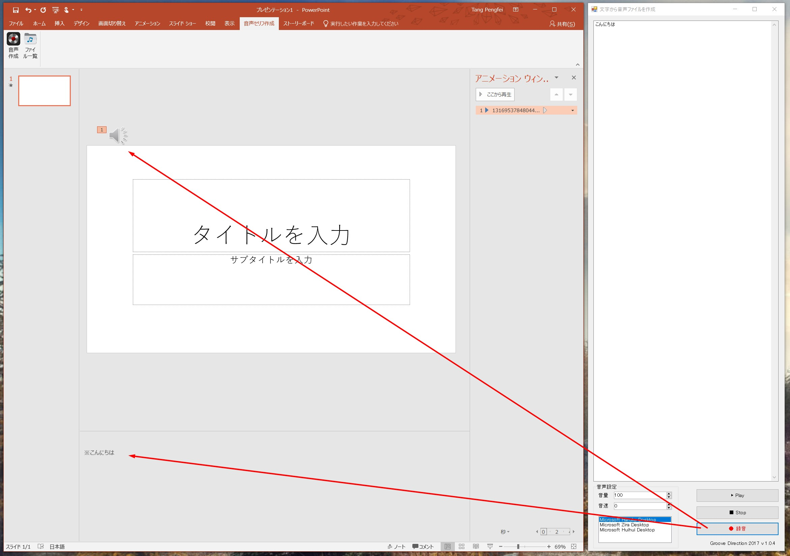

# PowerPoint音声セリフ作成プラグイン(MS PowerPoint TTS Add-in)

## 1.概要
上図に示すように、音声セリフ作成プラグインは文字(Text)を音声ファイル(Speech)に変換するツールです。

変換した音声ファイルをそのままページに挿入することができます。

そしてアニメーションウィンドで音声の流れ順を調整し、最後PowerPointのビデオ出力機能を使えば、セリフ付きのビデオが作成できます。

英語からはじめ、中国語と日本語もサポートしています。

---

## 2.インストール

フォルダー「1_Install」に入って、1~5の順番通りにインストールしてください。

1. SpeechPlatformRuntime_x86.msi : Windowsの音声プラットフォームインストールファイル(x86ライブラリ)
1. SpeechPlatformRuntime_x64.msi : Windowsの音声プラットフォームインストールファイル(x64ライブラリ)
1. MSSpeech_TTS_ja-JP_Haruka.msi : 日本語サポート
1. MSSpeech_TTS_zh-CN_HuiHui.msi : 中国語サポート
1. PPTPlugin.zip : 音声セリフプラグイン本体(Zipファイルを解凍し、その中の「PowerPointTTS.vsto」を実行してください。)

---

## 3.紹介ビデオ

PowerPoint用VSTOアドイン：音声セリフサポートツール ( [https://youtu.be/ITwN-yy6u_w](https://youtu.be/ITwN-yy6u_w) )
